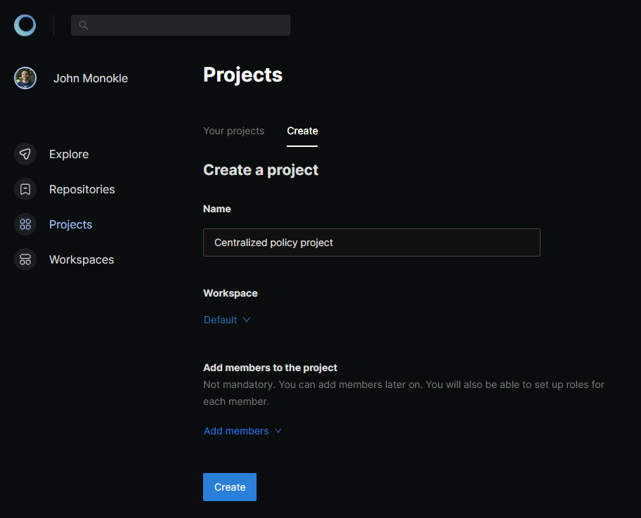
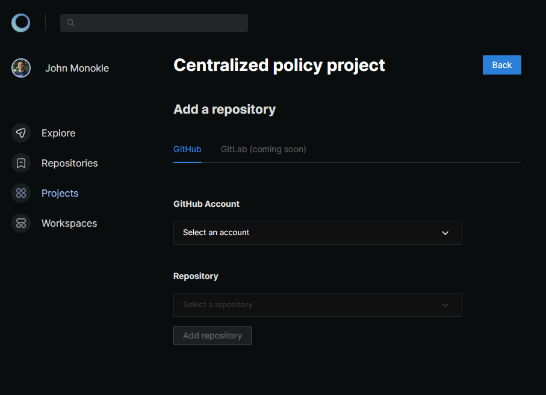
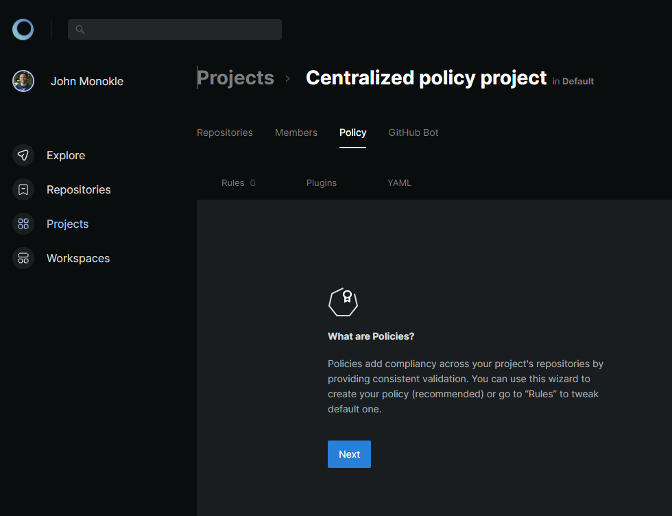

<p align="center">
  
</p>

<p align="center">
  <a href="https://github.com/kubeshop/monokle-cli">
    
  </a>
  <a href="https://github.com/kubeshop/monokle-cli/actions/workflows/check.yaml">
    
  </a>
  <a href="https://github.com/kubeshop/monokle-cli">
    
  </a>
</p>

# Welcome to Monokle CLI

Monokle CLI is a command-line interface for static analysis of Kubernetes resources.

Use it to prevent misconfigurations within Kustomize, Helm or default Kubernetes resources. The output is available as a SARIF file which you can upload to GitHub CodeScan.

Monokle CLI allows integration with [Monokle Cloud](https://app.monokle.com/) to manage and enforce validation policies centrally for all your repos and pipelines.

You can read more about Monokle CLI features and entire Monokle Ecosystem in [announcement blog-post](https://monokle.io/blog/monokle-cli-flexible-kubernetes-yaml-validation).

## Table of contents

- [Installation](#installation)
- [Usage](#usage)
- [Validation](#validation)
  - [Validate a YAML file](#validate-a-yaml-file)
  - [Validate a directory](#validate-a-directory)
  - [Validate a templated Helm chart](#validate-a-templated-helm-chart)
  - [Validate a Kustomize build](#validate-a-kustomize-build)
  - [Validate using local configuration file](#validate-using-local-configuration-file)
  - [Validate using centralized policy from Monokle Cloud](#validate-using-centralized-policy-from-monokle-cloud)
  - [Frameworks](#frameworks)
  - [Generate SARIF analysis](#generate-sarif-analysis)
- [Using with Monokle Cloud](#using-with-monokle-cloud)
- [Using on CI/CD pipelines](#using-on-cicd-pipelines)
- [Monokle GitHub Bot](#monokle-github-bot)
- [Configuration](#configuration)
  - [Command-line arguments](#command-line-arguments)
  - [@monokle/validation rules](#monoklevalidation-rules)
  - [Custom validators](#custom-validators)
- [Docker](#docker)

## Installation

You can install Monokle CLI via npm:

```bash
npm install --global @monokle/cli
```

Or using brew if you're on MacOS:

```bash
brew install kubeshop/monokle/monokle-cli
```

## Usage

Monokle CLI exposes following commands:

* `monokle validate [path]` - validate Kubernetes resources in a given path.
* `monokle init` - use wizard to generate local policy configuration file.
* `monokle login` - login to Monokle Cloud to use remote policy.
* `monokle logout`- logout from Monokle Cloud.
* `monokle whoami` - get information about currently authenticated user.
* `monokle config show [path]` - show policy configuration file which will be used to validated given path.

You can always use `--help` argument to get list of all available commands or detailed information about each command.

## Validation

Monokle CLI includes built-in validators to provide you with comprehensive validation possibilities for K8s configurations out of the box:

- **Pod Security Standards** validation for secure deployments
- **Kubernetes Schema** validation to ensure your resource are compliant with their schemas and a target K8s version
- **Resource links** validates that reference to other Kubernetes resources are valid.
- **Metadata** validation for standard and custom labels/annotations
- **Common practices** validation for basic configuration sanity
- **Security policies** based on OPA (Open Policy Agent) to reduce your attack surface.
- **YAML Syntax** validates that your manifests have correct YAML syntax.

Under the hood it uses [@monokle/validation][https://github.com/kubeshop/monokle-core/tree/main/packages/validation] which allows you to configure validation rules extensively.

Once installed, using the CLI is straight-forward.

### Validate a YAML file

```bash
monokle validate bundle.yaml
```

### Validate a directory

This will recursively scan all YAML files and parse them as plain Kubernetes resources.

```bash
monokle validate k8s-dir
```

### Validate a templated Helm chart

```bash
helm template helm-dir | monokle validate -
```

### Validate a Kustomize build

```bash
kustomize build kustomize-dir/overlays/local | monokle validate -
```

### Validate using local configuration file

```bash
monokle validate path/to/validate -c path/to/config/monokle.validation.yaml
```

### Validate using centralized policy from Monokle Cloud

To use remote policy, you need to login to Monokle CLoud first. This can be done via `monokle login` command:

```bash
monokle login
```

After that, simply run `validate` command. Monokle CLI will fetch remote policy based on your user data:

```bash
monokle validate path/to/validate
```

> **IMPORTANT**: Please keep in mind that remote policies needs to be configured first. Please refer to [Using with Monokle Cloud](#using-with-monokle-cloud) section below.

### Frameworks

Monokle CLI supports predefined sets of rules called frameworks, which allow you to quickly run Monokle validation without the need for additional configuration.
By using a framework, you can easily perform comprehensive validations based on established best practices and industry standards.

When using a framework, you don't have to configure the `monokle.validation.yaml` file manually.
Simply specify the desired framework using the `--framework` or `-f` CLI arguments, and Monokle CLI will automatically apply the corresponding set of rules.

Available frameworks:

- `pss-restricted`
- `pss-baseline`
- `nsa`

Using frameworks is an excellent way to get started quickly with Monokle CLI and perform comprehensive validations without the need for extensive configuration.

Here's an example of how to use the `--framework` argument:

```bash
monokle validate k8s-dir --framework pss-restricted
```

If you prefer a more customized validation, you can still configure the `monokle.validation.yaml` file with your own rules. The easiest way is to use `monokle init` command which will guide you through creating custom configuration based on available frameworks.

### Generate SARIF analysis

The Monokle CLI can output its results in [SARIF format](https://sarifweb.azurewebsites.net/).

```bash
monokle validate --output sarif k8s-dir > results.sarif
```

Afterward you could use [VSC's SARIF Viewer][vsc-sarif] or other tools to inspect the results.

## Using with Monokle Cloud

To use remote policy with Monokle CLI you will need to create a project and configure policy for it in Monokle Cloud. Start by signing in to [Monokle Cloud](https://app.monokle.com).

> In case of doubts, refer to [Getting Started Guide](https://docs.monokle.com/tutorials/getting-started) or hit us directly on [Discord](https://discord.com/invite/6zupCZFQbe).

### Project setup

After signing up, start by creating a project on [Projects page](https://app.monokle.com/dashboard/projects):

<p align="center">
  
</p>

### Add your repository to your project

After project is created, add a repository (the one you will be working locally with) to a project. This can be done by going to `Repositories` tab in project view and using `Add repository` button:

<p align="center">
  
</p>

### Policy setup

The last step is policy setup. You can use policy wizard by going to `Policy` tab in project view:

<p align="center">
  
</p>

After the setup is done, you can run `monokle validate` command and it will use remote policy as long as you are logged in.

## Using on CI/CD pipelines

> We have dedicated [`Monokle GitHub Bot`](#monokle-github-bot) to integrate centralized policy management into GitHub CI/CD pipelines which gives more extensive integration than using CLI directly.

To use Monokle CLI as part of CI/CD pipeline, it needs to be installed first and then simply run with `monokle validate path/to/resources`.

The other case is using centrally managed policy from Monokle Cloud in such scenarios. Then, CLI needs to be authenticated first. For this there is a dedicated argument exposed by both `monokle validate` and `monokle login` command: `--api-token` (or `-t`). This allows to pass API token directly without using interactive login flow.

If you need to run single validation it should be enough to use `monokle validate path/to/resources -t YOUR_API_TOKEN`. However, for scenarios where multiple validations runs are required it might be more convenient to login first with `monokle login -t YOUR_API_TOKEN` and then simply run `monokle validate path/to/resources`.

> **IMPORTANT**: Always remember to keep your API token as secret and pass it to CI/CD jobs the same way as other secrets.

## Monokle GitHub Bot

The [Monokle GitHub Bot](https://docs.monokle.com/concepts/github-bot) can be used to validate your resources as part of your CI/CD pipelines. It is integrated with [Monokle Cloud](https://app.monokle.com/) out-of-the-box to allow easy centralized policy management.

## Monokle GitHub Action

The [Monokle GitHub Action](https://github.com/marketplace/actions/monokle-validation) can be used to validate your resources as part of your CI/CD pipelines
on GitHub.

If you need something tightly integrated with Monokle Cloud, we recommend using [`Monokle GitHub Bot`](#monokle-github-bot).

## Configuration

### Command-line arguments

You can use `--help` to access help information directly from the CLI.

### @monokle/validation rules

The Monokle CLI looks for a Monokle Validation configuration file
at `./monokle.validation.yaml`. You can change this by using the `--config` flag.

All rules are enabled by default and are described in the [Monokle Validation configuration][monokle-validation-docs] documentation.

**Example**

```yaml
plugins:
  yaml-syntax: true
  kubernetes-schema: true
rules:
  yaml-syntax/no-bad-alias: "warn"
  yaml-syntax/no-bad-directive: false
  open-policy-agent/no-last-image: "err"
  open-policy-agent/cpu-limit: "err"
  open-policy-agent/memory-limit: "err"
  open-policy-agent/memory-request: "err"
settings:
  kubernetes-schema:
    schemaVersion: v1.24.2
```

### Custom validators

It is easy to extend the Monokle CLI with [custom validators][custom-validators] that can be shared with others using our [Monokle Community Plugins][monokle-community-plugins] repository.

## Docker

You can use the Docker image `monokle-cli:latest` to run the Monokle CLI in a containerized environment.
This can be particularly useful for integrating Monokle into CI/CD pipelines or other automated systems.

To run the Docker image, you can use the `docker run` command.
The Monokle CLI arguments can be passed directly to the Docker run command.
For example:
```
docker run -v /path/to/input:/input -e CONFIG_FILE=my-validation-config.yaml monokle-cli:latest validate /input
```

In this command:
  - `-v /path/to/input:/input` mounts a directory from your host system to the /input directory inside the Docker container.
  - `-e CONFIG_FILE=my-validation-config.yaml` sets an environment variable inside the Docker container. If this environment variable is set, the Docker container will use the specified file as the Monokle validation configuration.
  - `validate /input` is the command that will be passed to the Monokle CLI. You can replace this with any command you want to run with the Monokle CLI.

[core-validators]: https://github.com/kubeshop/monokle-core/blob/main/packages/validation/docs/core-plugins.md
[custom-validators]: https://github.com/kubeshop/monokle-core/blob/main/packages/validation/docs/custom-plugins.md
[monokle-community-plugins]: https://github.com/kubeshop/monokle-community-plugins
[monokle-validation]: https://github.com/kubeshop/monokle-core/tree/main/packages/validation
[monokle-validation-docs]: https://github.com/kubeshop/monokle-core/blob/main/packages/validation/docs/configuration.md
[vsc-sarif]: https://marketplace.visualstudio.com/items?itemName=MS-SarifVSCode.sarif-viewer
